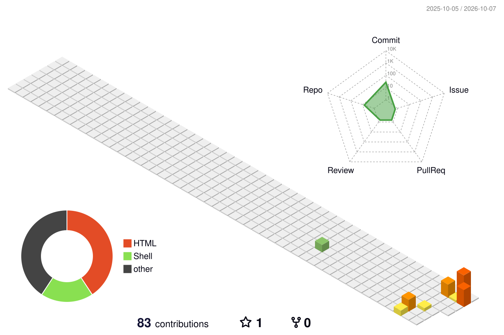

# Hey, I'm Carlos 👋

Based in Medellín, Colombia, training to become a fullstack developer, one CESDE module at a time.

## What I'm working on

I'm in a *Contrato de Aprendizaje* at **CESDE**, going for a technical certificate in Software Development. Right now that looks like:

- Backend: **Java**, with Spring Boot coming up next
- Frontend: **JavaScript**, working my way into React
- Databases: **SQL Server** and **MySQL**
- Some **PHP** and **HTML** along the way

  

## Outside of code

FPS and sandbox games eat up more of my free time than they probably should, and I'm almost always in the middle of some sci-fi book.

---

### GitHub stats

  
  

### 3D contribution graph

  

### Find me elsewhere

